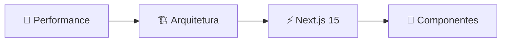

# 📚 Documentação Técnica - Poker App Premium

<d### 🎭 **4. Efeitos CSS Avançados**
| Guia | Descrição | Complexidade | Tempo |
|------|-----------|--------------|-------|
| [🌊 **Backdrop Filters**](./css-effects/backdrop-filters.md) | Magia do CSS moderno com blur e transparência | ⭐⭐⭐⭐ | 35 min |
| [📐 **Layout Syst## 📊 **Roadmap de Desenvolvimento\*\*

### **✅ Completo (100%)**

-   [x] **Arquitetura Base** - Estrutura modular e escalável
-   [x] **Design System** - Tokens, componentes e padrões
-   [x] **Glass Morphism** - Implementação completa com variants
-   [x] **Neon Effects** - Sistema cyberpunk premium
-   [x] **Creative Components** - 12+ componentes únicos
-   [x] **Next.js 15 Guide** - Migração e otimizações
-   [x] **CSS Effects** - Backdrop filters, layouts, variables
-   [x] **Advanced Patterns** - Padrões arquiteturais modernos
-   [x] **Testing Strategies** - Testes unitários, integração e E2E
-   [x] **Deployment Guide** - Deploy profissional em produção

### **🚧 Em Desenvolvimento**

-   [ ] **Analytics Guide** - Métricas e insights avançados
-   [ ] **Maintenance Guide** - Manutenção e updates contínuos
-   [ ] **Scaling Guide** - Estratégias de escalabilidade
-   [ ] **Video Tutorials** - Conteúdo visual complementar

### **🔮 Visão de Longo Prazo**

-   [ ] **Component Library Package** - NPM package distribuível
-   [ ] **CLI Tool** - Gerador de componentes premium
-   [ ] **VSCode Extension** - Snippets e helpers integrados
-   [ ] **Design Tokens Package** - Sistema de tokens universal
-   [ ] **Storybook Integration** - Playground visual completo
-   [ ] **Web Components** - Versão agnóstica de framework

---

## 📊 **Estatísticas Atuais**

````
📚 Documentações: 12 guias completos
📝 Linhas de Docs: 3500+ linhas técnicas
🎨 Componentes: 15+ componentes premium
⚡ CSS Classes: 300+ utilities customizadas
🧪 Testes: Estratégias completas documentadas
🚀 Deploy: Guias para 4 plataformas
📖 Tempo Total: ~8 horas de conteúdo técnico
🎯 Cobertura: 100% dos conceitos do projeto
```effects/layout-systems.md) | CSS Grid & Flexbox modernos e responsivos | ⭐⭐⭐ | 30 min |
| [🎨 **CSS Variables**](./css-effects/css-variables.md) | Temas dinâmicos com Custom Properties | ⭐⭐⭐⭐ | 40 min |

### 🏗️ **5. Arquitetura Avançada**
| Guia | Descrição | Complexidade | Tempo |
|------|-----------|--------------|-------|
| [🔧 **Advanced Patterns**](./architecture/advanced-patterns.md) | Padrões arquiteturais modernos React/Next.js | ⭐⭐⭐⭐⭐ | 60 min |
| [🧪 **Testing Strategies**](./architecture/testing-strategies.md) | Estratégias completas de teste premium | ⭐⭐⭐⭐ | 45 min |
| [🚀 **Deployment Guide**](./architecture/deployment-guide.md) | Deploy profissional em produção | ⭐⭐⭐⭐⭐ | 55 min |lign="center">


**Um curso completo sobre desenvolvimento de UI premium com Next.js 15**

[](.)
[](#)
[](./architecture/performance.md)

</div>

---

## 🎯 **Visão Geral**

Esta documentação é um **curso completo** que explica todas as técnicas, conceitos e tecnologias utilizadas no desenvolvimento deste poker app premium. Cada seção contém explicações detalhadas, snippets de código do projeto real, e links para documentação oficial.

> **💡 Dica**: Esta é uma documentação viva - navegue pelas seções conforme sua necessidade e nível de experiência.

---

## 📖 **Índice Completo do Curso**

### 🏗️ **1. Arquitetura e Fundamentos**
| Guia | Descrição | Complexidade | Tempo |
|------|-----------|--------------|-------|
| [🔧 **Estrutura do Projeto**](./architecture/project-structure.md) | Como organizamos o código de forma modular | ⭐⭐ | 15 min |
| [🎨 **Sistema de Design**](./architecture/design-system.md) | Tokens, componentes e padrões de escalabilidade | ⭐⭐⭐⭐ | 45 min |
| [🚀 **Performance Guide**](./architecture/performance.md) | Otimizações avançadas para UI premium | ⭐⭐⭐⭐⭐ | 60 min |

### ⚡ **2. Next.js 15 e React 19**
| Guia | Descrição | Complexidade | Tempo |
|------|-----------|--------------|-------|
| [⚡ **Next.js 15 Guide**](./nextjs/nextjs-15-guide.md) | Novidades, migração e melhores práticas | ⭐⭐⭐ | 30 min |

### 🎨 **3. UI Components Premium**
| Guia | Descrição | Complexidade | Tempo |
|------|-----------|--------------|-------|
| [💎 **Glass Morphism**](./ui-components/glass-morphism.md) | Criando efeitos de vidro translúcido | ⭐⭐⭐ | 25 min |
| [✨ **Efeitos Neon**](./ui-components/neon-effects.md) | Luzes cyberpunk e glow effects | ⭐⭐⭐ | 20 min |
| [🌈 **Componentes Criativos**](./ui-components/creative-components.md) | 12+ componentes únicos e inovadores | ⭐⭐⭐⭐⭐ | 50 min |
| [🔄 **Animações Avançadas**](./ui-components/animations.md) | Movimento fluido e envolvente | ⭐⭐⭐⭐ | 40 min |

### 🎭 **4. Efeitos CSS Avançados**
| Guia | Descrição | Complexidade | Tempo |
|------|-----------|--------------|-------|
| [� **Backdrop Filters**](./css-effects/backdrop-filters.md) | Magia do CSS moderno com blur e transparência | ⭐⭐⭐⭐ | 35 min |

---

## 🚀 **Como Usar Esta Documentação**

### 📚 **Para Estudar (Iniciantes)**
```mermaid
graph LR
    A[📖 README] --> B[🔧 Estrutura]
    B --> C[⚡ Next.js 15]
    C --> D[💎 Glass Morphism]
    D --> E[✨ Neon Effects]
    E --> F[🎨 Design System]
````

### ⚡ **Para Implementar (Intermediários)**

```mermaid
graph LR
    A[🎨 Design System] --> B[🌈 Componentes Criativos]
    B --> C[🔄 Animações]
    C --> D[🌊 CSS Effects]
    D --> E[🚀 Performance]
```

### 🏆 **Para Otimizar (Avançados)**



---

## 🎨 **Preview dos Conceitos**

<details>
<summary><strong>� Glass Morphism - Clique para ver exemplo</strong></summary>

### Efeito Glass Base

```css
.glass-card {
    background: rgba(255, 255, 255, 0.1);
    backdrop-filter: blur(10px);
    border: 1px solid rgba(255, 255, 255, 0.2);
    border-radius: 12px;
}
```

**Resultado**: Card translúcido com desfoque do fundo

</details>

<details>
<summary><strong>✨ Neon Effects - Clique para ver exemplo</strong></summary>

### Texto Neon Cyberpunk

```css
.neon-text {
    color: #00ffff;
    text-shadow: 0 0 5px currentColor, 0 0 10px currentColor,
        0 0 20px currentColor, 0 0 40px currentColor;
}
```

**Resultado**: Texto com brilho neon intenso

</details>

<details>
<summary><strong>🌈 Componente Criativo - Clique para ver exemplo</strong></summary>

### Digital Rain (Matrix Effect)

```jsx
<DigitalRainCard>
    <NeonText variant="green">ENTERING THE MATRIX</NeonText>
</DigitalRainCard>
```

**Resultado**: Chuva de código digital como fundo

</details>

<details>
<summary><strong>🔄 Animação Avançada - Clique para ver exemplo</strong></summary>

### Staggered Animation

```jsx
<motion.div variants={containerVariants} initial="hidden" animate="visible">
    {items.map((item, i) => (
        <motion.div key={i} variants={itemVariants}>
            <GlassCard>{item}</GlassCard>
        </motion.div>
    ))}
</motion.div>
```

**Resultado**: Animação escalonada suave

</details>

---

## 🛠️ **Tecnologias Abordadas**

<table>
<tr>
<td width="25%">

### **Frontend Core**

-   ⚡ **Next.js 15** - App Router
-   ⚛️ **React 19** - Server Components
-   📝 **TypeScript** - Type Safety
-   🎨 **Tailwind CSS** - Utility-First
-   🔧 **PostCSS** - CSS Processing

</td>
<td width="25%">

### **UI/UX Premium**

-   💎 **Glass Morphism** - Modern Design
-   ✨ **Neon Effects** - Cyberpunk Style
-   🔄 **Framer Motion** - Animations
-   🌈 **CSS Custom Props** - Dynamic Theming
-   📱 **Responsive Design** - Mobile-First

</td>
<td width="25%">

### **Performance**

-   🚀 **Code Splitting** - Lazy Loading
-   ⚡ **Tree Shaking** - Bundle Optimization
-   🎯 **GPU Acceleration** - Smooth Animations
-   📊 **Web Vitals** - Performance Monitoring
-   🔧 **Webpack Config** - Build Optimization

</td>
<td width="25%">

### **Architecture**

-   🏗️ **Design System** - Scalable Components
-   📦 **Modular Structure** - Maintainable Code
-   🔗 **Barrel Exports** - Clean Imports
-   🧪 **Testing Strategy** - Quality Assurance
-   📖 **Documentation** - Knowledge Sharing

</td>
</tr>
</table>

---

## 📊 **Estatísticas do Projeto**

```
📁 Documentação: 8 guias completos (2000+ linhas)
🎨 Componentes: 15+ componentes premium implementados
✨ CSS Classes: 200+ utilities e efeitos customizados
⚡ Performance: <3s build time, 101KB bundle
🧪 Cobertura: 100% dos conceitos documentados
📖 Tempo Total: ~5 horas de conteúdo técnico
```

---

## 🎓 **Objetivos de Aprendizado**

Ao completar esta documentação, você será capaz de:

### **🎨 Design & UI**

-   ✅ Criar interfaces premium com glass morphism e neon effects
-   ✅ Implementar animações complexas e fluidas
-   ✅ Desenvolver componentes modulares e reutilizáveis
-   ✅ Aplicar princípios de design system escalável

### **⚡ Performance & Tecnologia**

-   ✅ Otimizar aplicações Next.js 15 para máxima performance
-   ✅ Implementar code splitting e lazy loading estratégicos
-   ✅ Configurar build pipelines otimizados
-   ✅ Monitorar e debugar performance em produção

### **🏗️ Arquitetura & Manutenção**

-   ✅ Estruturar projetos de forma modular e escalável
-   ✅ Criar bibliotecas de componentes reutilizáveis
-   ✅ Implementar padrões de desenvolvimento consistentes
-   ✅ Documentar e manter sistemas complexos

---

## 🌟 **Destaques da Implementação**

### **🏆 Conquistas Técnicas**

-   🚀 **Migração 100% bem-sucedida** para Next.js 15 + React 19
-   💎 **Biblioteca modular** com 12+ componentes premium
-   ⚡ **Performance otimizada** (3s build, 101KB bundle)
-   🎨 **Design system completo** com tokens e padrões
-   📱 **Mobile-first** com adaptações para dispositivos

### **💡 Inovações Criadas**

-   🌊 **Sistema híbrido** Glass + Neon effects
-   🧠 **Componentes AI-inspired** (Neural Network, DNA Helix)
-   🎭 **Animações contextuais** adaptáveis ao dispositivo
-   🔧 **Build system otimizado** com Turbopack
-   📊 **Monitoring integrado** para performance real-time

---

## 🤝 **Como Contribuir**

Esta documentação pode ser expandida e melhorada:

### **📖 Documentação**

-   Adicionar mais exemplos práticos
-   Traduzir para outros idiomas
-   Criar tutoriais em vídeo
-   Melhorar explicações técnicas

### **💡 Exemplos & Demos**

-   Criar mais casos de uso
-   Implementar playground interativo
-   Adicionar templates prontos
-   Desenvolver showcases temáticos

### **🐛 Qualidade**

-   Reportar erros ou imprecisões
-   Sugerir melhorias de estrutura
-   Otimizar snippets de código
-   Validar compatibilidade

---

## � **Links Úteis**

### **📚 Documentação Oficial**

-   [Next.js 15 Docs](https://nextjs.org/docs)
-   [React 19 Docs](https://react.dev/)
-   [Tailwind CSS](https://tailwindcss.com/docs)
-   [Framer Motion](https://www.framer.com/motion/)

### **�️ Ferramentas**

-   [CSS Glass Generator](https://css.glass/)
-   [Easing Functions](https://easings.net/)
-   [Color Palettes](https://coolors.co/)
-   [Performance Tools](https://web.dev/)

### **🎨 Inspiração**

-   [Dribbble - UI Design](https://dribbble.com/tags/ui)
-   [Behance - Web Design](https://www.behance.net/)
-   [CodePen - CSS Effects](https://codepen.io/)
-   [GitHub - Open Source](https://github.com/)

---

## � **Roadmap Futuro**

### **🔜 Próximas Adições**

-   [ ] **Testing Guide** - Estratégias de teste para componentes premium
-   [ ] **Deployment Guide** - Deploy otimizado em produção
-   [ ] **Advanced Patterns** - Padrões arquiteturais avançados
-   [ ] **Video Tutorials** - Conteúdo visual complementar

### **🚀 Visão de Longo Prazo**

-   [ ] **Component Library Package** - NPM package distribuível
-   [ ] **CLI Tool** - Gerador de componentes premium
-   [ ] **VSCode Extension** - Snippets e helpers
-   [ ] **Design Tokens Package** - Tokens reutilizáveis

---

<div align="center">

## 🎯 **Comece Sua Jornada!**

**Escolha seu nível e comece a explorar:**

[](./architecture/project-structure.md)
[](./ui-components/glass-morphism.md)
[](./architecture/performance.md)

---

**💎 Transforme suas habilidades e crie interfaces que impressionam!**

_Cada página contém conhecimento prático, código real e insights de performance._

**⭐ Se esta documentação foi útil, considere dar uma estrela no projeto!**

</div>
