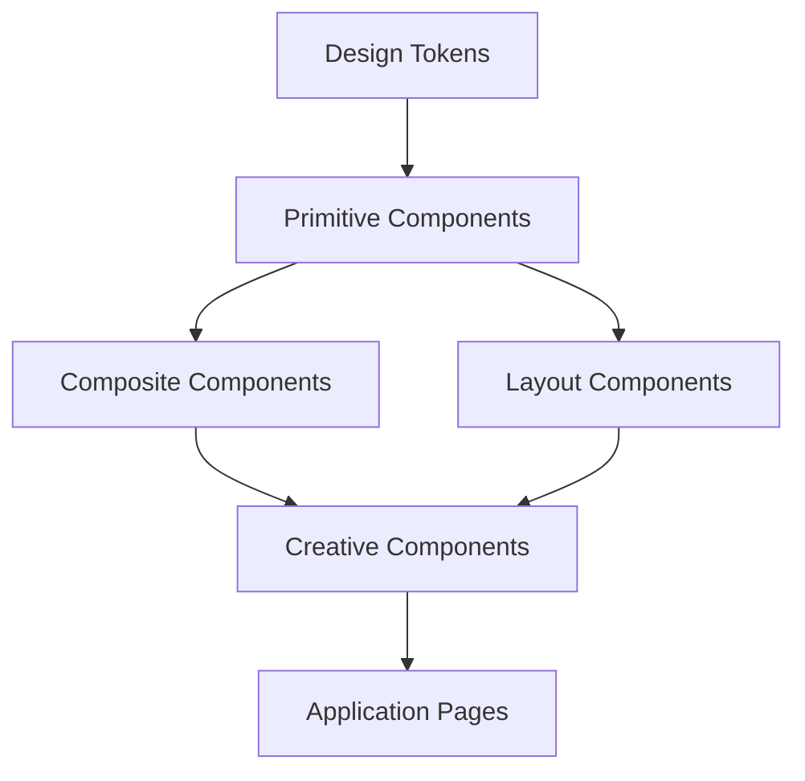

# 🎨 Sistema de Design Modular - Arquitetura Premium

<div align="center">


**Criando consistência e escalabilidade através de design**

</div>

---

## 🎯 **Filosofia do Design System**

Um **design system** não é apenas uma coleção de componentes - é uma **linguagem visual consistente** que:

-   🎨 **Unifica** a experiência do usuário
-   ⚡ **Acelera** o desenvolvimento
-   📐 **Padroniza** decisões de design
-   🔧 **Facilita** manutenção e evolução

---

## 🏗️ **Arquitetura do Sistema**

### **Hierarquia de Abstrações**

```
🎨 Design System
├── 🔧 Design Tokens        # Valores fundamentais
├── 🎭 Primitive Components # Elementos básicos
├── 🏗️ Composite Components # Combinações complexas
├── 📱 Layout Components    # Estrutura e organização
└── 🎪 Creative Components  # Efeitos especiais
```

### **Fluxo de Dependências**



---

## 🔧 **Design Tokens**

### **1. Fundação Visual**

```typescript
// components/ui/glass/tokens.ts
export const DESIGN_TOKENS = {
    // 🎨 Cores base
    colors: {
        primary: {
            50: "#ecfeff",
            100: "#cffafe",
            400: "#22d3ee", // Cyan principal
            500: "#06b6d4",
            900: "#164e63",
        },

        secondary: {
            400: "#f472b6", // Magenta/Pink
            500: "#ec4899",
            600: "#db2777",
        },

        accent: {
            400: "#4ade80", // Green para sucesso
            500: "#22c55e",
            600: "#16a34a",
        },

        neutral: {
            50: "#f8fafc",
            100: "#f1f5f9",
            400: "#94a3b8",
            500: "#64748b",
            900: "#0f172a",
        },
    },

    // 📏 Espaçamento
    spacing: {
        xs: "0.25rem", // 4px
        sm: "0.5rem", // 8px
        md: "1rem", // 16px
        lg: "1.5rem", // 24px
        xl: "2rem", // 32px
        "2xl": "3rem", // 48px
        "3xl": "4rem", // 64px
    },

    // 📝 Tipografia
    typography: {
        fontFamily: {
            sans: ["Inter", "system-ui", "sans-serif"],
            mono: ["JetBrains Mono", "Fira Code", "monospace"],
        },

        fontSize: {
            xs: ["0.75rem", { lineHeight: "1rem" }],
            sm: ["0.875rem", { lineHeight: "1.25rem" }],
            base: ["1rem", { lineHeight: "1.5rem" }],
            lg: ["1.125rem", { lineHeight: "1.75rem" }],
            xl: ["1.25rem", { lineHeight: "1.75rem" }],
            "2xl": ["1.5rem", { lineHeight: "2rem" }],
            "3xl": ["1.875rem", { lineHeight: "2.25rem" }],
        },
    },

    // 🌊 Animações
    animation: {
        duration: {
            fast: "150ms",
            normal: "300ms",
            slow: "500ms",
        },

        easing: {
            easeOut: "cubic-bezier(0.4, 0, 0.2, 1)",
            easeIn: "cubic-bezier(0.4, 0, 1, 1)",
            easeInOut: "cubic-bezier(0.4, 0, 0.2, 1)",
        },
    },

    // 🔍 Efeitos glass
    glass: {
        background: {
            subtle: "rgba(255, 255, 255, 0.05)",
            medium: "rgba(255, 255, 255, 0.1)",
            strong: "rgba(255, 255, 255, 0.2)",
        },

        blur: {
            subtle: "4px",
            medium: "8px",
            strong: "16px",
        },

        border: {
            subtle: "rgba(255, 255, 255, 0.1)",
            medium: "rgba(255, 255, 255, 0.2)",
            strong: "rgba(255, 255, 255, 0.3)",
        },
    },
} as const;
```

### **2. Semantic Tokens**

```typescript
// Tokens semânticos baseados nos primitivos
export const SEMANTIC_TOKENS = {
    // 📊 Estados de interface
    interface: {
        success: DESIGN_TOKENS.colors.accent[400],
        warning: "#f59e0b",
        error: "#ef4444",
        info: DESIGN_TOKENS.colors.primary[400],
    },

    // 🎭 Contextos de uso
    context: {
        background: {
            primary: DESIGN_TOKENS.colors.neutral[900],
            secondary: DESIGN_TOKENS.colors.neutral[800],
            elevated: DESIGN_TOKENS.glass.background.medium,
        },

        text: {
            primary: DESIGN_TOKENS.colors.neutral[50],
            secondary: DESIGN_TOKENS.colors.neutral[400],
            accent: DESIGN_TOKENS.colors.primary[400],
        },

        border: {
            default: DESIGN_TOKENS.glass.border.medium,
            focus: DESIGN_TOKENS.colors.primary[400],
            error: "#ef4444",
        },
    },
} as const;
```

---

## 🎭 **Primitive Components**

### **1. Base Component Pattern**

```tsx
// components/ui/glass/primitives/base.tsx
interface BaseProps {
    className?: string;
    children?: React.ReactNode;
}

interface VariantProps<T extends string> {
    variant?: T;
    size?: "sm" | "md" | "lg";
}

interface InteractiveProps {
    disabled?: boolean;
    loading?: boolean;
    onClick?: () => void;
}

// Utility para variant classes
export function createVariantClasses<T extends Record<string, string>>(
    variants: T,
    defaultVariant: keyof T
) {
    return (variant: keyof T = defaultVariant) => variants[variant];
}
```

### **2. Primitive Button**

```tsx
// components/ui/glass/primitives/button.tsx
interface ButtonProps
    extends BaseProps,
        VariantProps<"solid" | "outline" | "ghost">,
        InteractiveProps {
    type?: "button" | "submit" | "reset";
}

const buttonVariants = createVariantClasses(
    {
        solid: [
            "bg-primary-500 text-white",
            "hover:bg-primary-600",
            "border border-primary-500",
        ].join(" "),

        outline: [
            "bg-transparent text-primary-400",
            "hover:bg-primary-400/10",
            "border border-primary-400",
        ].join(" "),

        ghost: [
            "bg-transparent text-neutral-300",
            "hover:bg-white/10",
            "border border-transparent",
        ].join(" "),
    },
    "solid"
);

export function Button({
    variant = "solid",
    size = "md",
    disabled = false,
    loading = false,
    className,
    children,
    ...props
}: ButtonProps) {
    return (
        <button
            disabled={disabled || loading}
            className={cn(
                // Base styles
                "relative inline-flex items-center justify-center",
                "font-medium rounded-lg transition-all duration-200",
                "focus:outline-none focus:ring-2 focus:ring-primary-400/50",

                // Variant styles
                buttonVariants(variant),

                // Size styles
                {
                    "px-3 py-1.5 text-sm": size === "sm",
                    "px-4 py-2 text-base": size === "md",
                    "px-6 py-3 text-lg": size === "lg",
                },

                // State styles
                {
                    "opacity-50 cursor-not-allowed": disabled,
                    "cursor-wait": loading,
                },

                className
            )}
            {...props}
        >
            {loading && (
                <div className="absolute inset-0 flex items-center justify-center">
                    <div className="w-4 h-4 border-2 border-current border-t-transparent rounded-full animate-spin" />
                </div>
            )}

            <span
                className={cn(
                    "flex items-center gap-2",
                    loading && "invisible"
                )}
            >
                {children}
            </span>
        </button>
    );
}
```

### **3. Primitive Input**

```tsx
// components/ui/glass/primitives/input.tsx
interface InputProps
    extends Omit<React.InputHTMLAttributes<HTMLInputElement>, "size"> {
    variant?: "default" | "ghost" | "neon";
    size?: "sm" | "md" | "lg";
    error?: boolean;
    label?: string;
    helperText?: string;
}

export function Input({
    variant = "default",
    size = "md",
    error = false,
    label,
    helperText,
    className,
    ...props
}: InputProps) {
    const inputId = useId();

    return (
        <div className="space-y-1">
            {label && (
                <label
                    htmlFor={inputId}
                    className="block text-sm font-medium text-neutral-300"
                >
                    {label}
                </label>
            )}

            <input
                id={inputId}
                className={cn(
                    // Base styles
                    "w-full rounded-lg border transition-all duration-200",
                    "bg-black/20 backdrop-blur-sm",
                    "placeholder:text-neutral-500",

                    // Size styles
                    {
                        "px-3 py-1.5 text-sm": size === "sm",
                        "px-4 py-2 text-base": size === "md",
                        "px-5 py-3 text-lg": size === "lg",
                    },

                    // Variant styles
                    {
                        "border-neutral-600 text-neutral-100 focus:border-primary-400":
                            variant === "default",
                        "border-transparent text-neutral-300 focus:border-neutral-500":
                            variant === "ghost",
                        "border-primary-400/50 text-primary-100 focus:border-primary-400":
                            variant === "neon",
                    },

                    // Error state
                    {
                        "border-red-400 focus:border-red-400": error,
                    },

                    // Focus styles
                    "focus:outline-none focus:ring-2 focus:ring-current/20",

                    className
                )}
                {...props}
            />

            {helperText && (
                <p
                    className={cn(
                        "text-xs",
                        error ? "text-red-400" : "text-neutral-500"
                    )}
                >
                    {helperText}
                </p>
            )}
        </div>
    );
}
```

---

## 🏗️ **Composite Components**

### **1. Card System**

```tsx
// components/ui/glass/composites/card.tsx
interface CardProps extends BaseProps {
    variant?: "glass" | "solid" | "outline";
    padding?: "none" | "sm" | "md" | "lg";
    header?: React.ReactNode;
    footer?: React.ReactNode;
}

export function Card({
    variant = "glass",
    padding = "md",
    header,
    footer,
    className,
    children,
    ...props
}: CardProps) {
    return (
        <div
            className={cn(
                "rounded-xl overflow-hidden",

                // Variant styles
                {
                    "bg-white/10 backdrop-blur-md border border-white/20":
                        variant === "glass",
                    "bg-neutral-800 border border-neutral-700":
                        variant === "solid",
                    "bg-transparent border border-neutral-600":
                        variant === "outline",
                },

                className
            )}
            {...props}
        >
            {header && (
                <div
                    className={cn("border-b border-current/10", {
                        "p-3": padding === "sm",
                        "p-4": padding === "md",
                        "p-6": padding === "lg",
                    })}
                >
                    {header}
                </div>
            )}

            <div
                className={cn({
                    "p-0": padding === "none",
                    "p-3": padding === "sm",
                    "p-4": padding === "md",
                    "p-6": padding === "lg",
                })}
            >
                {children}
            </div>

            {footer && (
                <div
                    className={cn("border-t border-current/10", {
                        "p-3": padding === "sm",
                        "p-4": padding === "md",
                        "p-6": padding === "lg",
                    })}
                >
                    {footer}
                </div>
            )}
        </div>
    );
}
```

### **2. Form System**

```tsx
// components/ui/glass/composites/form.tsx
interface FormFieldProps {
    label: string;
    error?: string;
    required?: boolean;
    children: React.ReactNode;
}

export function FormField({
    label,
    error,
    required,
    children,
}: FormFieldProps) {
    return (
        <div className="space-y-2">
            <label className="block text-sm font-medium text-neutral-300">
                {label}
                {required && <span className="text-red-400 ml-1">*</span>}
            </label>

            {children}

            {error && (
                <p className="text-sm text-red-400 flex items-center gap-1">
                    <ExclamationTriangleIcon className="w-4 h-4" />
                    {error}
                </p>
            )}
        </div>
    );
}

export function Form({ children, onSubmit, className, ...props }: FormProps) {
    return (
        <form
            onSubmit={onSubmit}
            className={cn("space-y-6", className)}
            {...props}
        >
            {children}
        </form>
    );
}
```

---

## 📱 **Layout Components**

### **1. Grid System**

```tsx
// components/ui/glass/layout/grid.tsx
interface GridProps extends BaseProps {
    cols?: 1 | 2 | 3 | 4 | 6 | 12;
    gap?: "sm" | "md" | "lg";
    responsive?: boolean;
}

export function Grid({
    cols = 3,
    gap = "md",
    responsive = true,
    className,
    children,
    ...props
}: GridProps) {
    return (
        <div
            className={cn(
                "grid",

                // Column count
                {
                    "grid-cols-1": cols === 1,
                    "grid-cols-2": cols === 2,
                    "grid-cols-3": cols === 3,
                    "grid-cols-4": cols === 4,
                    "grid-cols-6": cols === 6,
                    "grid-cols-12": cols === 12,
                },

                // Responsive behavior
                responsive && {
                    "grid-cols-1 md:grid-cols-2 lg:grid-cols-3": cols === 3,
                    "grid-cols-1 md:grid-cols-2 lg:grid-cols-4": cols === 4,
                },

                // Gap
                {
                    "gap-2": gap === "sm",
                    "gap-4": gap === "md",
                    "gap-6": gap === "lg",
                },

                className
            )}
            {...props}
        >
            {children}
        </div>
    );
}
```

### **2. Container System**

```tsx
// components/ui/glass/layout/container.tsx
interface ContainerProps extends BaseProps {
    size?: "sm" | "md" | "lg" | "xl" | "full";
    padding?: boolean;
    center?: boolean;
}

export function Container({
    size = "lg",
    padding = true,
    center = true,
    className,
    children,
    ...props
}: ContainerProps) {
    return (
        <div
            className={cn(
                // Center horizontally
                center && "mx-auto",

                // Max width based on size
                {
                    "max-w-sm": size === "sm",
                    "max-w-md": size === "md",
                    "max-w-4xl": size === "lg",
                    "max-w-6xl": size === "xl",
                    "max-w-none": size === "full",
                },

                // Padding
                padding && "px-4 sm:px-6 lg:px-8",

                className
            )}
            {...props}
        >
            {children}
        </div>
    );
}
```

---

## 🎪 **Component Composition**

### **1. Dashboard Card Pattern**

```tsx
// app/dashboard/components/stat-card.tsx
interface StatCardProps {
    title: string;
    value: string | number;
    trend?: "up" | "down" | "neutral";
    trendValue?: string;
    icon?: React.ComponentType<any>;
}

export function StatCard({
    title,
    value,
    trend,
    trendValue,
    icon: Icon,
}: StatCardProps) {
    return (
        <Card variant="glass" padding="lg">
            <div className="flex items-center justify-between">
                <div>
                    <p className="text-sm text-neutral-400">{title}</p>
                    <p className="text-2xl font-bold text-white mt-1">
                        {value}
                    </p>

                    {trend && trendValue && (
                        <div
                            className={cn(
                                "flex items-center gap-1 mt-2 text-sm",
                                {
                                    "text-green-400": trend === "up",
                                    "text-red-400": trend === "down",
                                    "text-neutral-400": trend === "neutral",
                                }
                            )}
                        >
                            {trend === "up" && (
                                <ArrowUpIcon className="w-4 h-4" />
                            )}
                            {trend === "down" && (
                                <ArrowDownIcon className="w-4 h-4" />
                            )}
                            <span>{trendValue}</span>
                        </div>
                    )}
                </div>

                {Icon && (
                    <div className="p-3 bg-primary-400/20 rounded-lg">
                        <Icon className="w-6 h-6 text-primary-400" />
                    </div>
                )}
            </div>
        </Card>
    );
}
```

### **2. Navigation Pattern**

```tsx
// components/layout/navigation.tsx
interface NavItem {
    label: string;
    href: string;
    icon?: React.ComponentType<any>;
    badge?: string;
}

interface NavigationProps {
    items: NavItem[];
    currentPath: string;
}

export function Navigation({ items, currentPath }: NavigationProps) {
    return (
        <nav className="space-y-1">
            {items.map((item) => {
                const isActive = currentPath === item.href;

                return (
                    <Link
                        key={item.href}
                        href={item.href}
                        className={cn(
                            "flex items-center gap-3 px-3 py-2 rounded-lg text-sm font-medium transition-colors",
                            isActive
                                ? "bg-primary-400/20 text-primary-400 border border-primary-400/30"
                                : "text-neutral-300 hover:bg-white/5 hover:text-white"
                        )}
                    >
                        {item.icon && <item.icon className="w-5 h-5" />}
                        <span>{item.label}</span>
                        {item.badge && (
                            <span className="ml-auto px-2 py-0.5 bg-primary-400/20 text-primary-400 text-xs rounded-full">
                                {item.badge}
                            </span>
                        )}
                    </Link>
                );
            })}
        </nav>
    );
}
```

---

## 📊 **Design System Metrics**

### **Component Coverage**

```typescript
// tools/design-system-metrics.ts
export const COMPONENT_METRICS = {
    primitives: {
        button: { variants: 3, sizes: 3, states: 4 },
        input: { variants: 3, sizes: 3, states: 3 },
        text: { variants: 4, sizes: 7, weights: 5 },
    },

    composites: {
        card: { variants: 3, layouts: 4 },
        form: { fields: 8, validation: 3 },
        navigation: { types: 3, states: 2 },
    },

    creative: {
        glass: { effects: 12, variants: 5 },
        neon: { colors: 4, intensities: 3 },
        animations: { types: 8, durations: 4 },
    },
};

// Calculate design system completeness
export function calculateSystemCompleteness(): number {
    const totalVariations = Object.values(COMPONENT_METRICS)
        .flatMap((category) => Object.values(category))
        .reduce((sum, component) => {
            return sum + Object.values(component).reduce((a, b) => a * b, 1);
        }, 0);

    return Math.min(totalVariations / 1000, 1) * 100; // Cap at 100%
}
```

### **Usage Analytics**

```tsx
// hooks/use-design-system-analytics.ts
export function useDesignSystemAnalytics() {
    const [usage, setUsage] = useState<Record<string, number>>({});

    const trackComponentUsage = useCallback((componentName: string) => {
        setUsage((prev) => ({
            ...prev,
            [componentName]: (prev[componentName] || 0) + 1,
        }));
    }, []);

    return { usage, trackComponentUsage };
}

// Component wrapper for tracking
export function withAnalytics<T>(
    Component: React.ComponentType<T>,
    componentName: string
) {
    return function AnalyticsWrappedComponent(props: T) {
        const { trackComponentUsage } = useDesignSystemAnalytics();

        useEffect(() => {
            trackComponentUsage(componentName);
        }, []);

        return <Component {...props} />;
    };
}
```

---

## 🚀 **Escalabilidade e Manutenção**

### **1. Component Versioning**

```typescript
// components/ui/glass/version.ts
export const DESIGN_SYSTEM_VERSION = "2.1.0";

export const COMPONENT_VERSIONS = {
    "glass-card": "1.2.0",
    "neon-text": "1.1.0",
    button: "2.0.0",
    input: "1.3.0",
} as const;

// Breaking change detection
export function checkBreakingChanges(
    oldVersion: string,
    newVersion: string
): boolean {
    const [oldMajor] = oldVersion.split(".").map(Number);
    const [newMajor] = newVersion.split(".").map(Number);

    return newMajor > oldMajor;
}
```

### **2. Theme System**

```typescript
// themes/cyberpunk.ts
export const cyberpunkTheme = {
    name: "cyberpunk",

    colors: {
        primary: "#00ffff",
        secondary: "#ff00ff",
        accent: "#00ff00",
        background: "#0a0a0a",
        surface: "#1a1a1a",
    },

    effects: {
        glass: {
            background: "rgba(0, 255, 255, 0.1)",
            border: "rgba(0, 255, 255, 0.2)",
        },

        neon: {
            glow: "0 0 20px currentColor",
            intensity: 1.2,
        },
    },
};

// Theme provider
export function ThemeProvider({ theme, children }: ThemeProviderProps) {
    return (
        <div
            className="theme-provider"
            style={{
                "--primary": theme.colors.primary,
                "--secondary": theme.colors.secondary,
                // ... other CSS variables
            }}
        >
            {children}
        </div>
    );
}
```

---

## 📖 **Documentação e Guidelines**

### **Component Documentation Pattern**

```typescript
// Each component should export its documentation
export const GlassCardDocs = {
    name: "GlassCard",
    description: "A translucent card with glass morphism effects",

    props: {
        variant: {
            type: "'subtle' | 'medium' | 'strong'",
            default: "medium",
            description: "Controls the intensity of the glass effect",
        },

        className: {
            type: "string",
            optional: true,
            description: "Additional CSS classes",
        },
    },

    examples: [
        {
            name: "Basic usage",
            code: "<GlassCard>Content here</GlassCard>",
        },
        {
            name: "With variant",
            code: '<GlassCard variant="strong">Strong glass effect</GlassCard>',
        },
    ],

    accessibility: [
        "Maintains proper contrast ratios",
        "Keyboard navigation supported",
        "Screen reader friendly",
    ],
};
```

---

## 🎓 **Próximos Passos**

1. ⚡ **Otimize**: [`Performance Guide`](./performance.md)
2. 🧪 **Teste**: [`Testing Strategies`](./testing.md)
3. 🚀 **Implemente**: [`Bundling Guide`](./bundling.md)

---

<div align="center">

**🎨 Um design system bem estruturado é o coração de uma aplicação escalável!**

_Continue explorando como otimizar performance e implementar testes._

</div>
